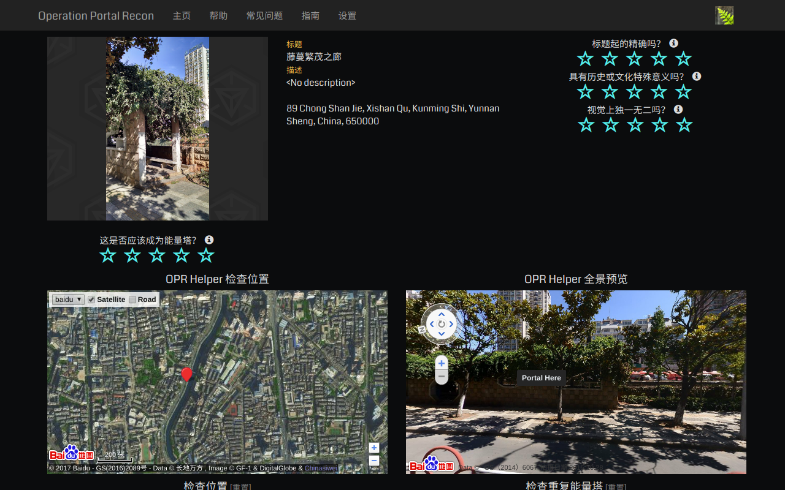

Ingress OPR Helper
==================
A helper for ingress portal recon system.

Screenshots
-----------

Installation
------------
#. Download the .crx file from `release page <https://github.com/zsrkmyn/ingress-opr-helper/releases>`_;
#. Open ``chrome://extensions`` in chrome;
#. Drag the downloaded file to the chrome.

Usage
-----
Just open `<https://opr.ingress.com/recon>`_.

Global configuration is available after clicking the extension icon. Local
configuration is on the top-left of the map.

FAQ
---
Q: Why not upload it to chrome store?

A: The author is too poor to pay the $5 developer register fee.

|

Q: The UI is ugly!

A: Yes, the author has no knowledge on front-end (and is lack of a girl to
help design the UI and wants to say, "CSS sucks").

|

Q: There are lots of bugs!

A: Issues and PRs are welcomed! Actually, the author has no skill in
programming. (What is programming? Is it eatable?)

Todo
----
- i18n
- Support for more third-party maps
- Show neighbor portals
- Make a more beautifiul UI (may be impossible for me)

